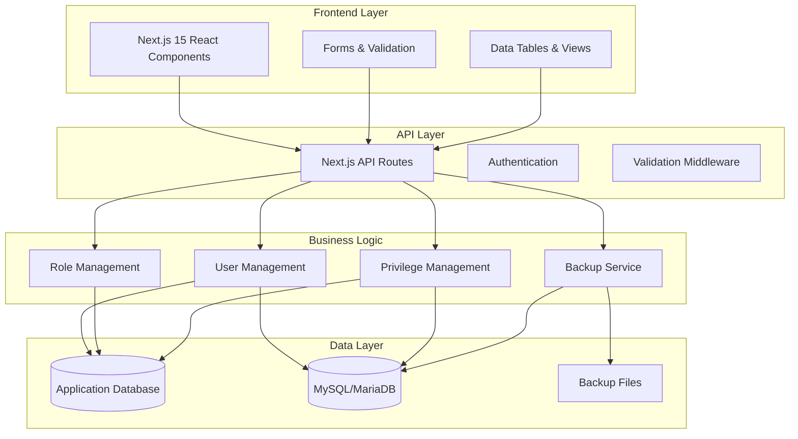
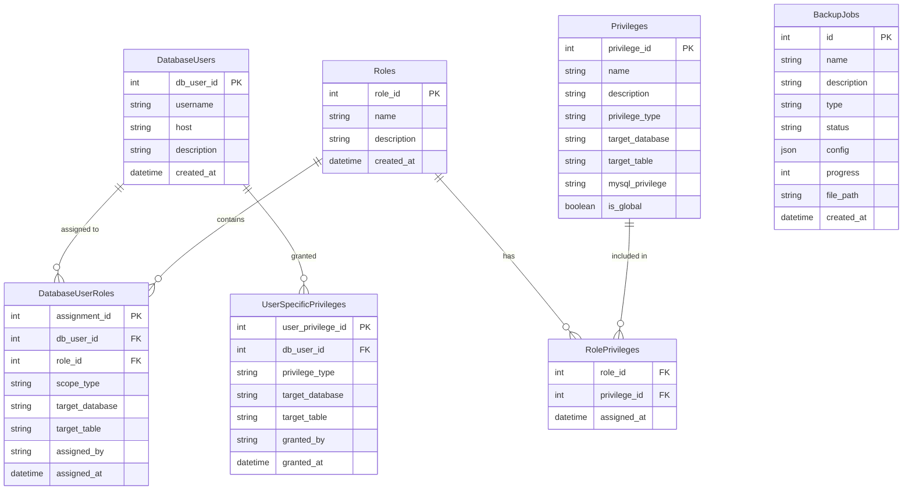

# 🔐 Advanced RBAC System with Database Backup & Recovery

A comprehensive Role-Based Access Control (RBAC) system built with **Next.js 15**, **TypeScript**, and **MySQL/MariaDB**. Features advanced scoped privilege management, real-time database operations, and integrated backup/recovery functionality.

## 🌟 Features

### 🔑 Core RBAC Features
- **User Management**: Create, update, delete database users with MySQL integration
- **Role Management**: Define custom roles with flexible privilege assignments
- **Scoped Privileges**: Global, database-level, and table-level permission scoping
- **Direct Privilege Grants**: Assign specific privileges directly to users
- **Real-time Synchronization**: Live sync between application and MySQL privilege system

### 💾 Backup & Recovery
- **Logical Backups**: Full mysqldump integration with schema and data
- **Flexible Backup Types**: Full, schema-only, data-only, and selective backups
- **Compression Support**: Optional gzip compression for space efficiency
- **Progress Tracking**: Real-time backup progress monitoring
- **Secure Restore**: Safe database restoration with overwrite protection

### 🎨 Modern UI/UX
- **Responsive Design**: Built with Tailwind CSS and shadcn/ui
- **Real-time Updates**: Live progress tracking and status updates
- **Intuitive Interface**: Clean, modern dashboard with tabbed navigation
- **Error Handling**: Comprehensive error reporting and user feedback

## Architecture Overview

```
┌─────────────────────────────────────────────────────────────────┐
│                    CLIENT SIDE (Browser)                        │
├─────────────────────────────────────────────────────────────────┤
│ • React Components                                               │
│ • lib/auth.ts (client auth)                                     │
│ • lib/db.ts (API calls only)                                    │
│ • hooks/use-realtime.ts (WebSocket client)                      │
└─────────────────────────────────────────────────────────────────┘
                                  │
                            HTTP/WebSocket
                                  │
┌─────────────────────────────────────────────────────────────────┐
│                    SERVER SIDE (Node.js)                        │
├─────────────────────────────────────────────────────────────────┤
│ • API Routes (/api/*)                                           │
│ • lib/db-server.ts (MariaDB connection)                         │
│ • lib/database-config.ts (connection pool)                      │
│ • lib/realtime-service.ts (WebSocket server)                    │
└─────────────────────────────────────────────────────────────────┘
                                  │
                            MySQL Protocol
                                  │
┌─────────────────────────────────────────────────────────────────┐
│                    MARIADB DATABASE                             │
├─────────────────────────────────────────────────────────────────┤
│ • Users, Roles, Privileges tables                               │
│ • UserRoles, RolePrivileges junction tables                     │
│ • Real-time data with connection pooling                        │
└─────────────────────────────────────────────────────────────────┘
```

### System Overview


### RBAC Data Model


## 🚀 Getting Started

### Prerequisites
- **Node.js** 18+ 
- **MySQL** 5.7+ or **MariaDB** 10.3+
- **npm** or **pnpm**

### Installation

1. **Clone the repository**
   ```bash
   git clone https://github.com/yourusername/rbac-system.git
   cd rbac-system
   ```

2. **Install dependencies**
   ```bash
   npm install
   # or
   pnpm install
   ```

3. **Set up environment variables**
   ```bash
   cp .env.example .env.local
   ```
   
   Configure your database connection:
   ```env
   DB_HOST=localhost
   DB_USER=root
   DB_PASSWORD=your_password
   DB_NAME=rbac_system
   ```

4. **Initialize the database**
   ```bash
   # Run SQL scripts in order
   mysql -u root -p < scripts/sql/01-create-tables.sql
   mysql -u root -p < scripts/sql/02-seed-data.sql
   mysql -u root -p < scripts/sql/03-backup-tables.sql
   ```

5. **Start the development server**
   ```bash
   npm run dev
   # or
   pnpm dev
   ```

6. **Open your browser**
   Navigate to [http://localhost:3000](http://localhost:3000)

## 📖 Usage

### User Management
- **Create Users**: Add new database users with MySQL integration
- **Assign Roles**: Assign roles with global, database, or table scope
- **Direct Privileges**: Grant specific privileges directly to users
- **View Assignments**: See all current role and privilege assignments

### Role & Privilege Management
- **Define Roles**: Create custom roles with specific privilege sets
- **Scope Control**: Set privileges at global, database, or table level
- **Privilege Types**: Support for all MySQL privilege types (SELECT, INSERT, UPDATE, DELETE, etc.)

### Backup & Recovery
- **Create Backups**: 
  - Full backups (schema + data)
  - Schema-only backups
  - Data-only backups
  - Selective table backups
- **Monitor Progress**: Real-time backup progress tracking
- **Manage Backups**: View, download, and delete backup files
- **Restore Data**: Safe restoration with overwrite protection

## 🛠️ Technical Stack

- **Frontend**: Next.js 15, React 19, TypeScript
- **Styling**: Tailwind CSS, shadcn/ui components
- **Backend**: Next.js API Routes, MySQL2
- **Database**: MySQL/MariaDB with connection pooling
- **Backup**: mysqldump integration with compression
- **Development**: ESLint, Prettier, TypeScript strict mode

## 📁 Project Structure

```
rbac-system/
├── app/                    # Next.js app directory
│   ├── api/               # API routes
│   │   ├── auth/         # Authentication endpoints
│   │   ├── backup/       # Backup management APIs
│   │   ├── users/        # User management APIs
│   │   ├── roles/        # Role management APIs
│   │   └── privileges/   # Privilege management APIs
│   ├── globals.css       # Global styles
│   ├── layout.tsx        # Root layout
│   └── page.tsx          # Home page
├── components/            # React components
│   ├── ui/               # shadcn/ui components
│   ├── admin-dashboard.tsx
│   ├── user-management.tsx
│   ├── role-management.tsx
│   ├── privilege-management.tsx
│   └── database-backup-recovery.tsx
├── lib/                   # Utility libraries
│   ├── db.ts             # Client-side database utils
│   ├── db-server.ts      # Server-side database operations
│   └── utils.ts          # General utilities
├── scripts/               # Database scripts
│   └── sql/              # SQL schema files
├── backups/              # Backup storage directory
└── docs/                 # Documentation
```

## 🔒 Security Features

- **Secure Authentication**: Temporary config files for database operations
- **SQL Injection Prevention**: Parameterized queries throughout
- **Privilege Validation**: Server-side validation of all privilege operations
- **Safe Backup/Restore**: Secure file handling and cleanup
- **Error Handling**: Comprehensive error logging and user feedback

## 🎯 API Endpoints

### User Management
- `GET /api/users` - List all users
- `POST /api/users` - Create new user
- `GET /api/users/[id]` - Get user details
- `PUT /api/users/[id]` - Update user
- `DELETE /api/users/[id]` - Delete user

### Role Assignment
- `GET /api/users/[id]/scoped-roles` - Get user role assignments
- `POST /api/users/[id]/scoped-roles` - Assign scoped role
- `DELETE /api/users/[id]/scoped-roles/[assignmentId]` - Revoke role assignment

### Backup Management
- `GET /api/backup/databases` - Get database information
- `POST /api/backup/create` - Create new backup
- `GET /api/backup/list` - List all backups
- `GET /api/backup/progress/[id]` - Get backup progress
- `POST /api/backup/restore` - Restore from backup
- `DELETE /api/backup/delete/[id]` - Delete backup

## 🤝 Contributing

1. Fork the repository
2. Create a feature branch (`git checkout -b feature/amazing-feature`)
3. Commit your changes (`git commit -m 'Add amazing feature'`)
4. Push to the branch (`git push origin feature/amazing-feature`)
5. Open a Pull Request

## 📄 License

This project is licensed under the MIT License - see the [LICENSE](LICENSE) file for details.

## 🙏 Acknowledgments

- [Next.js](https://nextjs.org/) for the amazing React framework
- [shadcn/ui](https://ui.shadcn.com/) for beautiful UI components
- [Tailwind CSS](https://tailwindcss.com/) for utility-first styling
- [MySQL](https://mysql.com/) / [MariaDB](https://mariadb.org/) for reliable database systems

## 📞 Support

If you encounter any issues or have questions:

1. Check the [Documentation](docs/)
2. Search existing [Issues](https://github.com/yourusername/rbac-system/issues)
3. Create a new [Issue](https://github.com/yourusername/rbac-system/issues/new)

---

**⭐ Star this repository if you find it helpful!**
